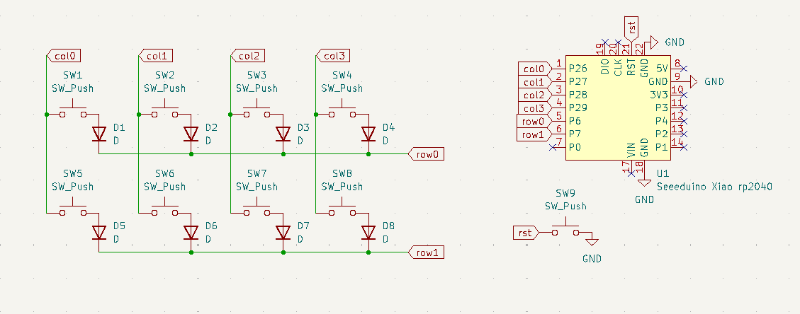
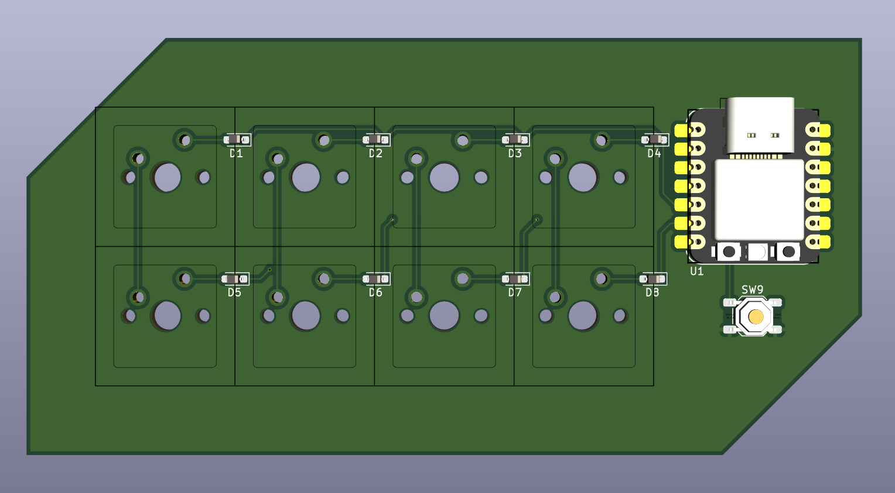

# KiCad Workshop

- Create Project
- Install marbastlib https://github.com/ebastler/marbastlib

## Schematic

- mouse select from left, everything that is completely in selection area is included in selection
- mouse select from right, everything that touches selection are included in selection
- `a` place part
- `w` add wire
- `r` rotate
- `m` move component
- `del` delete
- `g` grab, same as `m` but move wires with it
- `l`/`ctrl-l` add label/global-label
- `q` mark pins not connected
- `p` add power net
- `v` edit value
- `e` edit properties
- assign footprints
- `F8` update PCB from schematic

## PCB

- set custom gird, alternate between grids `alt-1`, `alt-2`
- set shove setting for traces
- `m` move
- `r` rotate, `R` rotate clockwise
- `x` lay down trace
- `v` add via (in trace command)
- `f` finish trace (in trace command)
- `u` select part of trace (in trace command), multiple presses select more
- `v` (not in trace) flip board
- `f` flip component to other side
- `d` displace (move with traces)
- `b` update fills
- `h` hide/dim other stuff
- DRC, design rule checker
- edge cut
- `alt-3` view 3d render
- add fill layer

## Additional Info

- https://www.youtube.com/watch?v=Stp5BqUI48U Kliment's PCB art for terrified beginners workshop

### useful plugins

- `interactive html BOM` for generating Interactive Bill Of Materials
- `Fabrication-toolkit`
- `KiKit` for panelization and other automatization
- `KiBuzzard` for fancy-ish Text
- `Bulk hide silkscreen designators` get rid off annoying silkscreen
